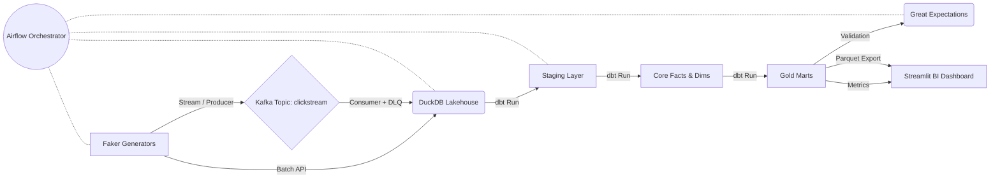

# E-Commerce Data Platform

End-to-end data engineering project built with Python, DuckDB, dbt, Kafka, Airflow and Streamlit.
All data is synthetically generated — no external datasets used.

## Setup
1. `python3 -m venv venv && source venv/bin/activate`
2. `pip install -r requirements.txt`
3. Copy `.env.example` to `.env` and fill in values
4. Run `python generators/generate_orders.py` to seed the database

## Airflow warning notes
- If you run **Airflow standalone with SQLite**, scheduler parallelism is intentionally constrained to 1 thread. This warning is expected with SQLite.
- For scalable parallel scheduling, use **Postgres** with `docker-compose.yml` (`LocalExecutor` + Postgres).
- `requirements.txt` pins `pendulum==2.1.2` to avoid deprecation warnings seen in some local Airflow setups.

## Stack
Faker · SQLite · FastAPI · Kafka · DuckDB · dbt · Airflow · Great Expectations · Streamlit

## 🌡️ Mac Thermal & Performance Guide
Running this entire data engineering stack locally can cause your Mac to heat up. To avoid thermal throttling:
1. **Component Isolation:** Do not run all services (Kafka, Airflow, API, Streamlit) simultaneously. Test batch, streaming, or UI separately.
2. **Throttle Streaming:** Event generation delay is set to 3 seconds to reduce CPU polling. Stop Kafka when not actively testing. 
3. **Trigger Airflow Manually:** Avoid running the Airflow scheduler continuously in the background. Trigger your DAGs manually when developing.
4. **Hardware/Monitor:** Keep your Mac on a hard surface, restrict unnecessary Chrome tabs, and use tools like `top` or `htop` to kill zombie processes.
## 🏗️ Architecture Diagram

## 🧠 Business Insights Summary
By running this end-to-end data pipeline, the resulting Streamlit dashboard distills several critical business insights:
- **Conversion Efficiency**: Tracking users from `page_view` through `purchase_complete` reveals exactly where drop-offs occur, allowing product teams to optimize UI funnels.
- **Customer Lifetime Value (LTV)**: By segmenting 'New' vs 'Repeat' users, marketing can tailor engagement campaigns directly to high-LTV return shoppers.
- **Category Profitability**: Real-time sales aggregation rapidly isolates top-performing categories against stagnating inventory.

## ⚙️ Why This Tech Stack?
- **Kafka & Zookeeper**: Provides decoupling for high-throughput clickstream data, handling massive ingestion without straining the analytical database.
- **DuckDB**: Sub-second analytical queries acting as a portable "Data Lakehouse" without the heavy setup of Snowflake or BigQuery.
- **dbt (Data Build Tool)**: Ensures modular, version-controlled SQL transformations, turning raw JSON/CSV dumps into clean, Kimball-style star schemas.
- **Apache Airflow**: The industry standard for robust DAG scheduling, ensuring the pipeline runs strictly in order (Extract -> Transform -> Test) with built-in retries.
- **Great Expectations**: Guarantees data observability by halting the pipeline if bad data (e.g. null User IDs, negative prices) breaches the reporting layer.
